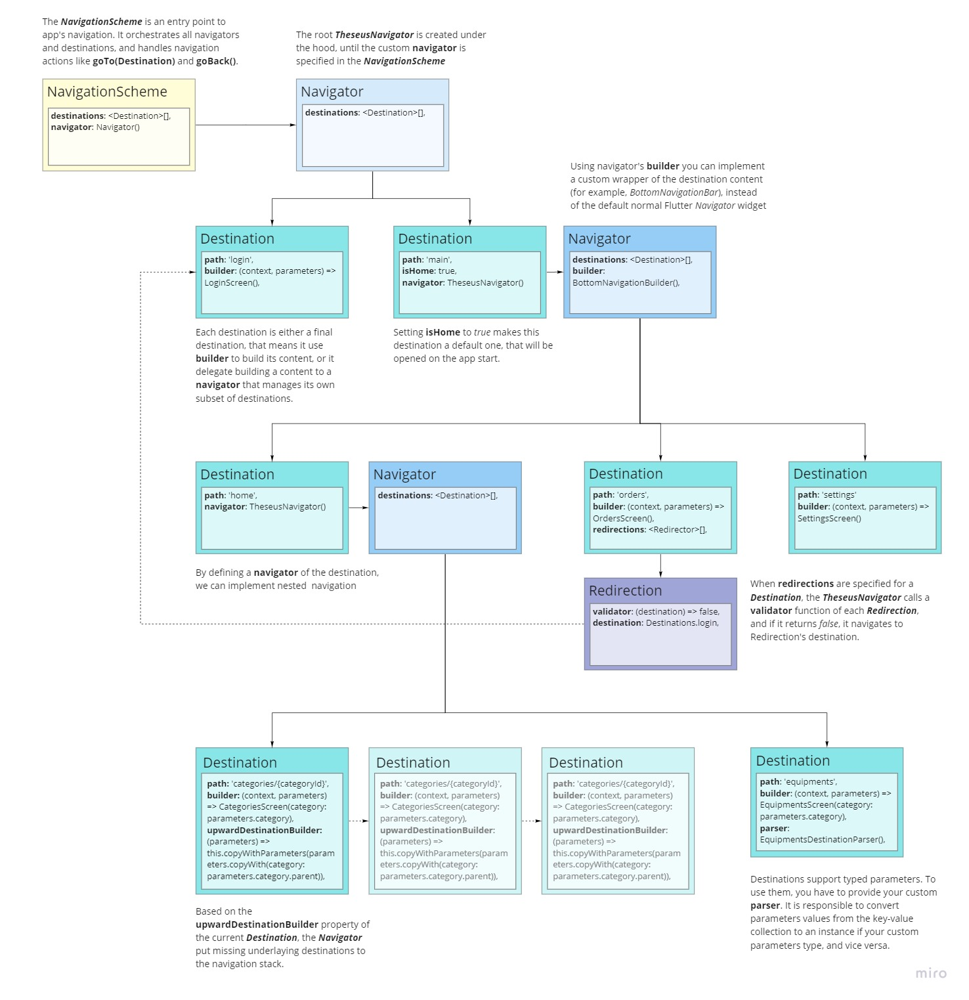

# Theseus Navigator
<a href="https://pub.dev/packages/theseus_navigator"></a>&nbsp;<a href="./LICENSE"></a>&nbsp;<a href="./test"></a>

Theseus Navigator package aims to simplify implementing a navigation in your app, and supports the following features:

- Declarative navigation scheme
- Strongly-typed parameters
- Deep links
- Nested navigation
- Dynamic upward navigation
- Redirections
- Persisting of navigation state
- Common navigation widgets

It provides a simple API, does not require code generation and uses Flutter's Router / Navigator 2.0 under the hood.


*Note: The package is still in progress, and APIs might change. Any feedback, like missing features, better API suggestions, bug reports and other is appreciated.*

You can check all supported features in the [Theseus Navigator Demo app](https://theseus-navigator.eche.dev/).

## Overview

The starting point of using Theseus Navigator is to define your app's navigation scheme.
It might look like this:



**Destinations** defines all possible UI endpoints in your app that users could reach using navigation.

**NavigationController** is responsible for managing the app navigation state within the scope of its destinations. It performs navigation actions, like `goTo(destination)` and `goBack()`, and builds the navigation stack.

The **NavigationScheme** is an entry point to navigation, it orchestrates all destinations and navigation controllers. It has a root navigation controller that manages top-level destinations, and, optionally, additional navigators to support nested navigation.

Here is an example of usage:
- Define destinations and navigation scheme
```dart
final homeDestination = Destination(
      path: 'home',
      isHome: true,
      builder: (context, parameters) => HomeScreen(),
    );
final catalogDestination = Destination(
      path: 'catalog',
      builder: (context, parameters) => CatalogScreen(),
    );
final settingsDestination = Destination(
      path: 'settings',
      builder: (context, parameters) => SettingsScreen(),
    ); 
final navigationScheme = NavigationScheme(
  destinations: [
    homeDestination,
    catalogDestination,
    settingsDestination,
  ],
);
```
- Setup a Router with your navigation scheme
```dart
@override
Widget build(BuildContext context) {
  return MaterialApp.router(
    //...
    routerDelegate: navigationScheme.routerDelegate,
    routeInformationParser: navigationScheme.routeParser,
  );
}
```
- Somewhere in the app to navigate
```dart
onTap: () => navigationScheme.goTo(ordersDestination)
```
## Destination
The `Destination` is a model of UI endpoint that user can navigate in your app.

Generally, you define a destination like this:
```dart
final homeDestination = Destination(
  path: 'home',
  builder: (context, parameters) => HomeScreen(),
);
```
It is a *final* destination, which directly displays the content returned by provided `builder` function.

#### Nested navigation

For nested navigation, instead of `builder` parameter you should provide a `navigator`, which is a `NavigationController`.  
It manages its own destinations, which could be either final ones and build the content or transit ones and provide another nested navigator.  

```dart
final mainDestination = Destination(
  path: '/',
  navigator: mainNavigator,
);

final mainNavigator = NavigationController(
  destinations:[
    homeDestination,
    catalogDestination,
    settingsDestination,
  ],
);
```
*The `NavigatorController` is described in next sections.*

By using `Destination.transit()` constructor it is also possible to wrap the nested navigation UI in some additional widget subtree.
```
final mainDestination = Destination.transit(
  path: '/',
  navigator: mainNavigator,
  builder: (context, parameters, child) {
    return Column(
      children: [
        const Text('Parent destination'),
        Expanded(child: child),
      ],  
    );
  }
);
```
This constructor has an optional `builder` parameter with additional `child` argument, which represents the nested content and must be included in the resulting widget tree.

#### Path
The destination is defined by its `uri`, which is built from the destination `path` and `parameters`.

The path might contains placeholders for path parameters. The last path parameter is optional. Arbitrary query parameters are also supported.

Example of destination path:

`/categories/{categoryId}`

The following specific URIs will match that destination path:

`/categories`  
`/categories/1`  
`/categories?q=someQuery`  
`/categories/1?q=someQuery`

Two last URIs contains a query parameter  as well, and still match the specified destination path.

#### Parameters

###### Default parameters handling

By default, destination parameters, both path and query, are extracted from the destination's URI into the `DestinationParameters` class. It stores them as `Map<String, String>`.

In this case you don't need specify a destination parser, the `DefaultDestinationParser` implementation is used implicitly.

 ```dart
final categoriesDestination = Destination(
    path: 'categories',
    builder: (context, params) => CategoryListScreen(
        parentCategoryId: params?['parentId'],
    ),
  );
```
For example above, the following URI `categories?parentId=2` would be parsed to a destination object that would build a CategoryListScreen with **parentCategoryId: 2**.

###### Custom type parameters

To use destination parameters of a certain type, you have to do the following:

- Create a class that extends `DestinationParameters` like this:
```dart
class CategoriesDestinationParameters extends DestinationParameters {
  CategoriesDestinationParameters({
    this.parentCategory,
  }) : super();

  final Category? parentCategory;
}
```
- Implement destination parser specific for your parameters type:
```dart
class CategoriesDestinationParser extends DestinationParser<CategoriesDestinationParameters> {
  CategoriesDestinationParser({
    required this.categoryRepository,
  });

  final CategoryRepository categoryRepository;

  @override
  Future<CategoriesDestinationParameters> parametersFromMap(Map<String, String> map) async {
    final category = await categoryRepository.getCategory(map['parentCategoryId'] ?? '');
    return CategoriesDestinationParameters(
      parentCategory: category,
    );
  }

  @override
  Map<String, String> parametersToMap(CategoryListParameters parameters) {
    final result = <String, String>{};
    if (parameters.parentCategory != null) {
      result['parentCategoryId'] = parameters.parentCategory!.id;
    }
    return result;
  }
}
```
- After that you will create your destination like:
```dart
final categoriesDestination = Destination<CategoriesDestinationParameters>(
    path: 'categories',
    builder: (context, params) => CategoryListScreen(
        parentCategory: params?.parentCategory,
    ),
    parser: CategoriesDestinationParser(
      categoryRepository: CategoryRepository(),
    ),
  );
```

#### Settings

The `DestinationSettings` contains attributes that are used to determine a logic and behavior of updating the navigation state with the destination.

`action` - defines how the navigation stack will be changed on navigation to the destination, can be **push** or **replace**.

`transition` - animations that would apply when the destination content appears, can be **material**, **custom**, or **none**.

In case of **custom** transition, you have to provide `transitionBuilder` as well.

There are two pre-defined factory methods:

- `material()` - returns a settings to pushes a destination to the stack with a standard Material animations.
- `dialog()` - display a destination as a modal dialog.
- `quite()` - replace the current destination with a new one without any animations.

```dart
final catalogDestination = Destination(
  path: 'catalog',
  builder: (context, parameters) => CatalogScreen(),
  settings: const DestinationSettings.quiet(),
);
```

## NavigationController

The `NavigationController` is a core component of the package, which manages the state of navigation.

It maintains the navigation stack of destinations and offers methods to update it, like `goTo(destination)` and `goBack()`.

Navigation controller is a `ChangeNotifier`, and notifies the `NavigationScheme` on any update of its navigation stack.

You have an access to the whole navigation `stack`, and to the top most destination in the stack using `currentDestination` property.

This example shows creation of the navigator that would wrap destinations with standard Flutter's `Navigator` widget:
```dart
final mainNavigator = NavigationController(
  destinations: [
    homeDestination,
    catalogDestination,
    settingsDestination,
  ],
  tag = 'Main',
);
```
`tag` attribute value is used in `GlobalKey` for the `Navigator` widget, and also allows to find logs related to this NavigationController instance.

#### Navigator Builder

NavigationController allows you to wrap destinations with your custom navigation UI.

This is required when you would like to navigate destinations through the `BottomNavigationBar`, `TabBar`, `Drawer` or some other way.

To do this, you have to extend the `NavigatorBuilder` class and override its `build` method:

```dart
class CustomNavigatorBuilder extends NavigatorBuilder {
  const CustomNavigatorBuilder() : super();

  @override
  Widget build(BuildContext context, NavigationController navigator) {
    // Your implementation of wrapper widget is here.
    // You have an access a navigator's stack and current destination.
  }
}
```
Then you should specify the `builder` in the navigator instance:

```dart
final mainNavigator = NavigationController(
  destinations: [
    homeDestination,
    catalogDestination,
    settingsDestination,
  ],
  builder: CustomNavigatorBuilder(),
  tag: 'Main',
);
```

###### Navigation via Bottom navigation bar, Drawer and Tab bar

The package includes implementations of `NavigatorBuilder` for most common cases:  
- `BottomNavigationBuilder` - uses Flutter's `Scaffold` with `BottomNavigationBar` or Material 3 `NavigationBar` to wrap the current destination content and to switch destinations.
- `DrawerNavigationBuilder` - allows to navigate using `Drawer` widget.
- `TabsNavigationBuilder` - uses `TabBar` to navigate destinations

fore example, adding the bottom navigation to your app is simple as following:

```dart
final navigationScheme = NavigationScheme(
  navigator: NavigationController(
    destinations: [
      homeDestination,
      catalogDestination,
      settingsDestination,
    ],
    builder: BottomNavigationBuilder(
      bottomNavigationItems: const <BottomNavigationBarItem>[
        BottomNavigationBarItem(
          icon: Icon(Icons.home_rounded),
          label: 'Home',
        ),
        BottomNavigationBarItem(
          icon: Icon(Icons.list_rounded),
          label: 'Catalog',
        ),
        BottomNavigationBarItem(
          icon: Icon(Icons.more_horiz_rounded),
          label: 'Settings',
        ),
      ],
    ),
    tag = 'Main',
  ), 
);
```
The styling of the `BottomNavigationBar` widget is supported by using optional `parameters` argument of the `BottomNavigationBuilder`.

You can use `DrawerNavigationBuilder` and `TabsNavigationBuilder` the same way.

#### Upward navigation

Sometimes, on reverse navigation from a destination that user accessed bypassing underlay destinations, we need to restore a missed destination hierarchy.

For example, user open an app by a deep link that leads to a category screen somewhere in the categories hierarchy. On navigating back from this screen we would like to show the upper level category screen, and so on until the root of categories.

The package support this behavior, when you define `upwardDestinationBuilder` parameter of destination.

It might look like this:
```dart
final categoriesDestination = Destination<CategoryListParameters>(
  path: 'categories',
  builder: (context, params) => CategoryListScreen(
      parentCategory: params?.category,
  ),
  upwardDestinationBuilder: (destination) =>
    destination.parameters?.parentCategory == null
        ? null
        : destination.copyWithParameters(CategoriesDestinationParameters(
            parentCategory:
                destination.parameters?.parentCategory!.parent)),
  parser: CategoriesDestinationParser(
    categoryRepository: CategoryRepository(),
  ),
);
```

## Deep-links

When a destination is requested by a platform, the following is happened for each navigator in the hierarchy from the current destination up to the root:

- Current destination is updated according to requested deep-link destination.

- If the `upwardDestinationBuilder` parameter is provided for the current destination, the navigator's stack is cleared before adding new destination. Otherwise the current destination is pushed to existing stack.

## Redirections

Sometimes we need to redirect user to another screen before displaying the requested content.

The basic example is that some screen should be shown only for signed in users.

The package provides `Redirection` class to support this behavior. You can specify a list of redirections for destinations that should be validated before navigation.
```dart
final settingsDestination = Destination(
      path: 'settings',
      builder: (context, parameters) => SettingsScreen(),
      redirections: [
        Redirection(
          validator: (destination) => SynchronousFuture(isLoggedIn),
          destination: loginDestination,
        )
      ]
    ); 
```
In the example above, when the user navigates to Settings screen, first the `validator` function of specified redirection will be called. If it return *false*, then user will be redirected to the Login screen.

Validator function in redirection could be asynchronous. In case it runs for a long time, the waiting overlay widget is displayed until the destination resolved. You can customize the waiting overlay by providing `waitingOverlayBuilder` parameter of `NavigationScheme`.

## Error handling

If the `errorDestination` is specified in the **NavigationScheme**, user wil be redirected to this destination when trying to navigate to nonexistent screen.

```dart
final navigationScheme = NavigationScheme(
  destinations: [
    //...
  ],
  errorDestination: Destination(
    path: '/error',
    builder: (context, parameters) => ErrorScreen(),
  )
);
```

The following errors are currently supported:
- Navigation to a destination that is not in the **NavigationScheme** (requested destination path does not match any destination in the scheme)
- The requested destination is found in the scheme, but its parameters could not be resolved by the destination's `parser`.

## Other

###### Examples
For more detailed code samples, please see the [example project](./example) which contains the working demo app.

###### Useful Links
[Material Design - Understanding Navigation](https://material.io/design/navigation/understanding-navigation.html)

[Routing packages research report](https://github.com/flutter/uxr/discussions/71#discussion-3525672)
