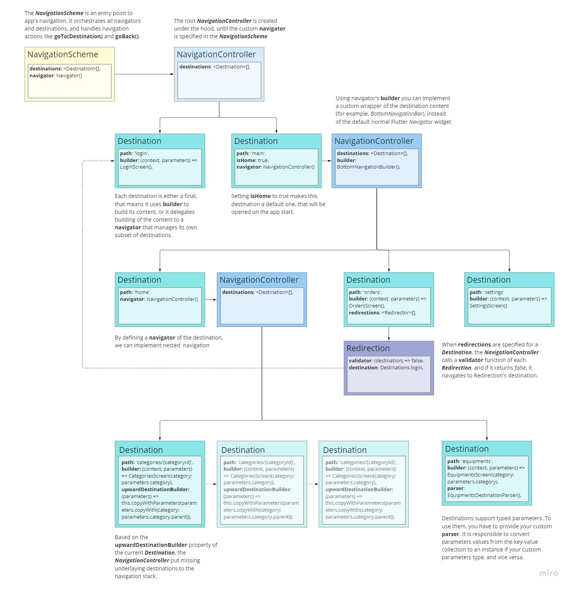

#### theseus_navigator

# Theseus Navigator
<a href="https://pub.dev/packages/theseus_navigator"></a>&nbsp;<a href="./LICENSE"></a>&nbsp;<a href="./test"></a>

Theseus Navigator package aims to simplify implementing a navigation in your app, and supports the following features:
- Declarative navigation scheme
- Strongly-typed parameters
- Deep links
- Nested and feature navigation
- Redirections
- Custom transitions

<video src='./assets/TheseusNavigatorDemo.mov' width=180/>

It provides a simple API, does not require code generation and uses Flutter's Router / Navigator 2.0 under the hood.

*Note: The package is still in progress. Any feedback, like missing features, better API suggestions, bug reports and other are appreciated.*

## Overview

The starting point of using Theseus Navigator is to define your app's navigation scheme.
It might look like this:



**Destinations** defines all possible UI endpoints in your app that users could reach using navigation.

**TheseusNavigator** is responsible for managing the app navigation state within the scope of its destinations. It performs navigation actions, like `goTo(destination)` and `goBack()`, and builds the navigation stack.

The **NavigationScheme** is the entry point to navigation and orchestrates all destinations and navigators. It has a root navigator that manages top-level destinations, and optionally additional navigators to support nested and/or feature navigation.

Here is an example of usage:
- Define destinations and navigation scheme
```dart
final homeDestination = DestinationLight(
      path: 'home',
      isHome: true,
      builder: (context, parameters) => HomeScreen(),
    );
final catalogDestination = DestinationLight(
      path: 'catalog',
      builder: (context, parameters) => CatalogScreen(),
    );
final settingsDestination = DestinationLight(
      path: 'settings',
      builder: (context, parameters) => SettingsScreen(),
    ); 
final navigationScheme = NavigationScheme(
  destinations: [
    homeDestination,
    catalogDestination,
    settingsDestination,
  ],
);
```
- Setup a Router with your navigation scheme
```dart
@override
Widget build(BuildContext context) {
  return MaterialApp.router(
    //...
    routerDelegate: TheseusRouterDelegate(navigationScheme: navigationScheme),
    routeInformationParser: TheseusRouterInformationParser(navigationScheme: navigationScheme),
  ),
}
```
- Somewhere in the app to navigate
```dart
onTap: () => navigationScheme.goTo(ordersDestination)
```
## Destination
The `Destination` is a model of UI endpoint that users can navigate in your app.

Generally, you define a destination like this:
```dart
final homeDestination = Destination<DefaultDestinationParameters>(
  path: 'home',
  builder: (context, parameters) => HomeScreen(),
);
```
You can use your custom parameters class as a generic type parameter of destination. In this case you have to provide your custom destination `parser`.

If you don't need typed parameters or don't care parameters at all for specific destination, you can use for shorten:
```dart
final homeDestination = DestinationLight(
  //...
);
```
If the destination is *final*, that means that it directly display some content, then you have to provide a `builder` function that returns a content widget.

Otherwise you should provide a `navigator` with its own destinations, which would build the content or contain another nested navigator.

#### Path
The destination is defined by its `uri`, which is built from the destination `path` and `parameters`.

The path might contains placeholders for path parameters. The last path parameter is optional.

Example of destination path:

`/categories/{categoryId}`

The following specific URIs will match that destination path:

`/categories`  
`/categories/1`  
`/categories?q=someQuery`  
`/categories/1?q=someQuery`

 Two last URIs contains a query parameter  as well, but still match the specified destination path.

#### Parameters

###### Default parameters handling

By default, destination parameters, both path and query, are extracted from the destination's URI into the `DefaultDestinationParameters` class. It stores them as `Map<String, String>`.

In this case you don't need specify a destination parser, the `DefaultDestinationParser` implementation is used implicitly.

 ```dart
final categoriesDestination = DestinationLight(
    path: 'categories',
    builder: (context, params) => CategoryListScreen(
        parentCategoryId: params?['parentId'],
    ),
  );
```
For example above, the following URI `categories?parentId=2` would be parsed to a destination object that would build a CategoryListScreen with **parentCategoryId: 2**.

###### Custom type parameters

To use destination parameters of a certain type, you have to do the following:

- Create a class that extends `DestinationParameters` like this:
```dart
class CategoriesDestinationParameters extends DestinationParameters {
  CategoriesDestinationParameters({
    this.parentCategory,
  });

  final Category? parentCategory;
}
```
- Implement destination parser specific for your parameters type:
```dart
class CategoriesDestinationParser extends DestinationParser<CategoriesDestinationParameters> {
  CategoriesDestinationParser({
    required this.categoryRepository,
  });

  final CategoryRepository categoryRepository;

  @override
  Future<CategoriesDestinationParameters> toDestinationParameters(Map<String, String> map) async {
    final category = await categoryRepository.getCategory(map['parentCategoryId'] ?? '');
    return CategoriesDestinationParameters(
      parentCategory: category,
    );
  }

  @override
  Map<String, String> toMap(CategoryListParameters parameters) {
    final result = <String, String>{};
    if (parameters.parentCategory != null) {
      result['parentCategoryId'] = parameters.parentCategory!.id;
    }
    return result;
  }
}
```
- After that you will create your destination like:
```dart
final categoriesDestination = Destination<CategoriesDestinationParameters>(
    path: 'categories',
    builder: (context, params) => CategoryListScreen(
        parentCategory: params?.parentCategory,
    ),
    parser: CategoriesDestinationParser(
      categoryRepository: CategoryRepository(),
    ),
  );
```

#### Configuration

The `DestinationConfiguration` contains attributes that are related to appearance of the destination when user navigates to or from it.

`action` - defines how the navigation stack will be updated when navigate to the destination, can be **push** or **replace**.

`transition` - animations that would apply when destination content appears, can be **material**, **custom**, or **none**.

In case of **custom** transition, you have to provide `transitionBuilder` as well.

There are two pre-defined factory methods:

`defaultMaterial()` - returns a configuration that pushes a destination to the stack with a standard Material animations.  
`quite()` - replace the current destination with a new one without any animations.

```dart
final catalogDestination = DestinationLight(
  path: 'catalog',
  builder: (context, parameters) => CatalogScreen(),
  configuration: const DestinationConfiguration.quiet(),
);
```

## TheseusNavigator

The `TheseusNavigator` is a core component of the package, which manages the state of navigation.

It maintains the navigation stack of destinations and offers methods to update it, like `goTo(destination)` and `goBack()`.

TheseusNavigator is a `ChangeNotifier`, and notifies the `NavigationScheme` on any update of navigation stack.

You have an access to the whole navigation `stack`, and to the top most destination in the stack using `currentDestination` property.

This example shows creation of the navigator that would wrap destinations with standard Flutter's `Navigator` widget:
```dart
final mainNavigator = TheseusNavigator(
  destinations: [
    homeDestination,
    catalogDestination,
    settingsDestination,
  ],
  debugLabel = 'Main',
);
```
`debugLabel` attribute value is used in `GlobalKey` for the `Navigator` widget, and also allows to find logs related to this TheseusNavigator instance.

#### Navigator Builder

TheseusNavigator allows you to wrap destinations with your custom widget.

This is required when you would like to navigate destinations through the `BottomNavigationBar`, `TabBar` or `Drawer`.

To do this, you have to implement the `NavigatorBuilder` class:

```dart
class CustomNavigatorBuilder implements NavigatorBuilder {
  const CustomNavigatorBuilder();

  @override
  Widget build(BuildContext context, TheseusNavigator navigator) {
    // Your implementation of wrapper widget is here.
    // You have an access a navigator's stack and current destination.
  }
}
```
Then you should specify this navigator `builder`:

```dart
final mainNavigator = TheseusNavigator(
  destinations: [
    homeDestination,
    catalogDestination,
    settingsDestination,
  ],
  builder: CustomNavigatorBuilder(),
  debugLabel = 'Main',
);
```

#### Upward Navigation

Sometimes, on reverse navigation from a destination that user accessed bypassing underlay destinations, we need to restore a missed destination hierarchy.

For example, user open an app by a deep link that leads to a category screen somewhere in the categories hierarchy. On navigating back from this screen we would like to show the upper level category screen, and so on until the root of categories.

TheseusNavigator support this behavior, when you define `upwardDestination` parameter for a destination.

It might look like this:
```dart
final categoriesDestination = Destination<CategoryListParameters>(
  path: 'categories',
  builder: (context, params) => CategoryListScreen(
      parentCategory: params?.category,
  ),
  upwardDestinationBuilder: (destination) =>
    destination.parameters?.parentCategory == null
        ? null
        : destination.copyWithParameters(CategoriesDestinationParameters(
            parentCategory:
                destination.parameters?.parentCategory!.parent)),
  parser: CategoriesDestinationParser(
    categoryRepository: CategoryRepository(),
  ),
);
```

## Redirections

Sometimes we need to redirect user to another screen before displaying the requested content.

The basic example is that some screen should be shown only for signed in users.

The package provides `Redirection` class to support this behavior. You can specify a list of redirections for destinations that should be validated before navigation.
```dart
final settingsDestination = DestinationLight(
      path: 'settings',
      builder: (context, parameters) => SettingsScreen(),
      redirections: [
        Redirection(
          validator: (destination) => SynchronousFuture(isLoggedIn),
          destination: loginDestination,
        )
      ]
    ); 
```
In the example above, when the iser navigates to Settings screen, first the `validator` function of specified redirection will be called. If it return *false*, then user will be redirected to the Login screen.
## Other

###### Examples
For more detailed code samples, please see the [example project](./example) which contains the working demo app.

###### Coming Updates
- Handling return values from destinations
- Handling navigation errors
- Navigator builders for `BottomNavigationBar`, `TabBar` and `Drawer`
- Configurations for modal dialog and bottom sheet destinations
- Test coverage

###### Useful Links
[Material Design - Understanding Navigation](https://material.io/design/navigation/understanding-navigation.html)

[Routing packages research report](https://github.com/flutter/uxr/discussions/71#discussion-3525672)
